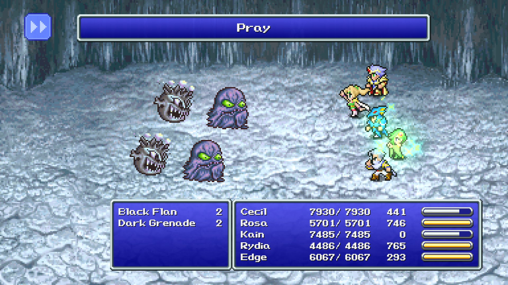
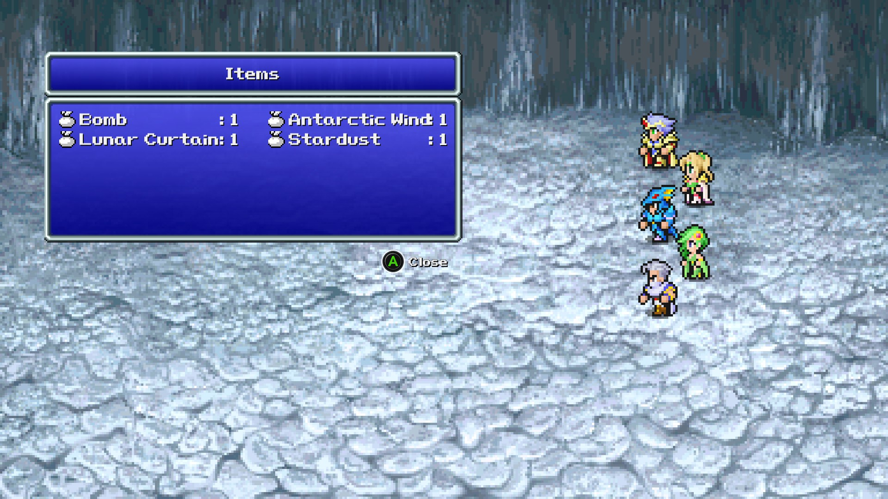

# final fantasy (pixel remaster) auto auto-battle

Better auto-grinder than auto-hot-key. This program detects when in and out of combat, engages in both movement and combat commands, uses game's built in auto-battle (for repeating prior commands), quick-saves after battle, and aborts in the event of death. Logs all actions out to console window viewable in the background.

Tested on `Final Fantasy IV` but written for all pixel remasters 1-6.



## Warning! Backup your saves!

I try my best to only use auto-save and not send key presses to random menus, but it's not bullet proof and I wouldn't want to save over precious existing saves.

You can download cloud backups manually if you like here: [cloud remote storage](https://store.steampowered.com/account/remotestorage) or just backup from disk

## How to use:

1.  Start the game and enter into the field where you want to grind/farm. Allow for up-down character movement without transitioning areas. 
1. (recommended) Start 1 fight manually and setup each characters moves

> Give your party an out. For example, Rosa has pray with no MP cost and some enemies are physical damage resistant, so it have Rydia cast blizarra/other. This allows for healing an an out for certain fights.

3. Finish the fight and at the field, begin the auto-auto-battle program.
3. The program will detect the window and state automatically and begin execution.

## Example output:

(non verbose)
```
BEGIN AUTO AUTO-BATTLER
Using PRESS Q (game autobattle prior commands) mode
Quick-saving after every battle
Death/main-menu detection active
Found: FINAL FANTASY IV
Handle: 2821526
Out of combat
Quicksave at: 5/23/2022 5:10:16 PM
Entering combat
In combat
Finishing combat
Quicksave at: 5/23/2022 5:10:37 PM
Out of combat
```

## Use a trainer instead:

No seriously if you're going for a super rare drop for achievement hunting, a trainer will give you 100% drop rate with a button without modifying the game either. 

I ran this for hours and still never got the `bomb` summon for Rydia in IV. A trainer gets you this immediately, where as the manual grind method EVEN AUTOMATED, can take hours if not days. (Mind Flayer matter of minutes. Bomb - seemingly forever for some reason)

If you want to rare hunt or auto-grind or compliment your game, have fun.



## How this works:

The pixel color near the bottom right of the screen is read to detect the `blue` battle menu. About 93% of the screen from the bottom-right at 16:9 aspect ratio.

`blue` means in combat. `not blue` means out of combat. `white` means death/battle-menu

The program works on a boolean state and knows when state changes occur. So it can do actions once after/before combat.

## Why:

Cause rare drops can be annoying (why I wrote it - though you can go use a trainer instead) or if you want an even more advance auto-grind.

## What doesn't work:

Only 16:9 tested. Ultra-widescreen resolutions or 4:3 untested/unaccounted for.

Windowed mode tested. Fullscreen not. 

## mode 1: use game's autobattle (default)

Will hit 'q' when a battle starts to use the game's auto-battle

## mode 2: enter spam

Will enter spam the fight. This can get you stuck with physical-resistant enemies

## quick-save

Quick-save after every fight is enabled by default

## death-detection

Near-white screen (menu screen) detects death and kills the auto-battle program. 

In a worse case scenario, quicksave would have occurred before death and the program stopping, so you can load the quick-save and recovery the party to continue.

## pausing

Commands run against the window in focus, but clicking the console/program window and hitting space should pause. Then you can manually do something in game and unpause. Or you can kill and restart the program.

## running from fight (manually)

When using autobattle, the game only hits `q` once, so you can hit `q` to stop and do a manual action. You can hold `2` and `3` to run from a fight. The game will automatically detect a transition out of battle and pick back up with movement. 

## verbose

Prints out all key presses to window

## todo?

1. read enemy names
2. track specific enemies, auto-run 
3. ai crazy to play the game for you (boring)